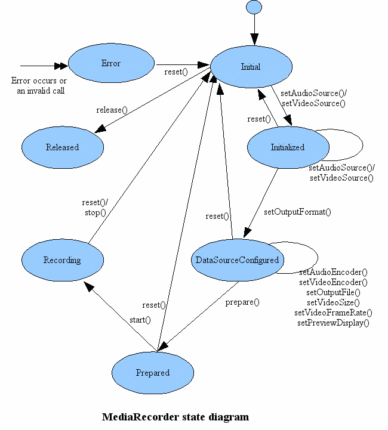

###MediaRecorder录音

MediaRecorder的一些状态：



> 常用方法

```
void prepare() 准备录制
void start() 开始录制
void stop() 停止录制
void reset() 重置MediaRecorder
void release() 释放MediaRecorder占用的资源
void setAudioEncoder(int) 设置音频记录的编码格式
void setAudioSource(int)  设置音频记录的音频源
void setOutputFormat(int)  设置记录的媒体文件的输出转换格式
void setPreviewDisplay(surface)  设置视频的预览界面
void setVideoEncoder(int)  设置视频记录的编码格式
void setVideoSource(int)  设置视频记录的视频源
void setOutputFile(String)  设置媒体文件输出路径
void setMaxDuration(int)  设置最大记录时长，单位为毫秒
```
- 当为MediaPlayer设定媒体录入源之后即初始化完成，这个时候才可以设置其他的参数
- 在开始录制钱必须先调用prepare准备录制
- 只有再intial初始化状态，才可以对MediaRecorder调用release()释放资源，其他状态必须先stop()和reset()
- 错误状态下，只有进行reset()才会进入Intial初始状态

> MediaRecorder录制视频比不可少的步骤

- 调用new MediaRecorder()构造函数得到MediaPlayer的实例
- 调用setOutputFormat()设定媒体文件的输出格式，必须再设定音频和视频的编码格式之前设定
- 如果需要调用音频，则调用setAudioSource()设定音频的录入源以及调用setAudioEncoder()设定音频的编码方式
- 如果需要调用视频，则调用setVideoSource()设定视频的录入源以及调用setVideoEncoder()设定视频的编码方式
- 调用setOutputFile()设定记录的媒体文件保存的路径
- 先调用prepare准备录制，准备完成之后调用start开始录制
- 记录完成，调用stop()停止录制

示例代码

```
private MediaRecorder mediaRecorder;
//开始录音
protected void start(){
	try{
		File file = new File("/sdcard/mediarecorder.amr");
		if(file.exists()){
			file.delete();
		}
		mediaRecorder = new MediaRecorder();
		mediaRecorder.setAudioSource(MediaRecorder.AudioSource.MIC);
		mediaRecorder.setOutputFormat(MediaRecorder.OutputFormat.THREE_GPP);
		mediaRecorder.setAudioEncorder(MediaPlayer.AudioEncoder.AMR_NB);
		mediaRecorder.setOutputFile(file.getAbsolutePath());
		mediaRecorder.setOnErrorListener(new OnErrorListener(){
			@Override
			public void onError(MediaRecorder mr,int what,int extra){
				mediaRecorder.stop();
				mediaRecorder.release();
				mediaRecorder = null;
				isRecording = false;
			}
		});
		mediaRecorder.prepare();
		mediaRecorder.start();
		isRecording = true;
	}catch(Exception e){
		e.printStackTrace();
	}
}

//录音结束
protected void stop(){
	if(isRecording){
		mediaRecord.stop();
		mediaRecord.release();
		mediaRecord = null;
		isRecording = false;
	}
}

@Override
public void onDestroy(){
	if(isRecording){
		mediaRecorder.stop();
		mediaRecorder.release();
		mediaRecorder = null;
	}
}
```

录制视频

```
protected void start(){
	try{
		File file = new File("/sdcard/video.mp4");
		if(!file.exists()){
			file.delete();
		}
		mediaRecorder = new MediaPlayer();
		mediaRecorder.reset();
		mediaRecorder.setAudioSource(MediaRecorder.AudioSource.MIC);
		mediaRecorder.setVideoSource(MediaRecorder.VideoSource.CAMERA);
		mediaRecorder.setOutputFormat(MediaRecorder.OutputFormat.MPEG_4);
		mediaRecorder.setAudioEncoder(MediaRecorder.AudioEncoder.DEFAULT);
		mediaRecorder.setVideoEncoder(MediaRecorder.VideoEncoder.MPEG_4_SP);
		//设置采样率
		mediaRecorder.setVideoFrameRate(4);
		mediaRecorder.setOutputFile(file.getAbsolutePath());
		mediaRecorder.setPreviewDisplay(surfaceView.getHolder().getSurface());
		mediaRecorder.setOnErrorListener(new OnErrorListener(){
			@Override
			public void onError(MediaRecorder mr,int what,int extra){
				mediaRecorder.stop();
				mediaRecorder.release();
				mediaRecorder = null;
				isRecording = false;
			}
		});
		mediaRecorder.prepare();
		mediaRecorder.start();
		isRecording = true;
	}catch(Exception e){
		e.printStackTrace();
	}
}

//停止录制
protected void stop(){
	if(isRecording){
		mediaRecorder.stop();
		mediaRecorder.release();
		mediaRecorder = null;
		isRecording = false;
	}
}

@Override
protected void onDestroy(){
	if(isRecording){
		mediaRecoder.stop();
		mediaRecoder.release();
		mediaRecoder = null;
	}
}
```

MediaRecoder内部类

- MediaRecoder.AudioEncoder 音频的编码格式
- MediaRecoder.AudioSource  录制的音频源
- MediaRecoder.OutputFormat  媒体文件的输出编码格式
- MediaRecoder.VideoEncoder  视频的编码格式
- MediaRecoder.VideoSource   录制的视频源
